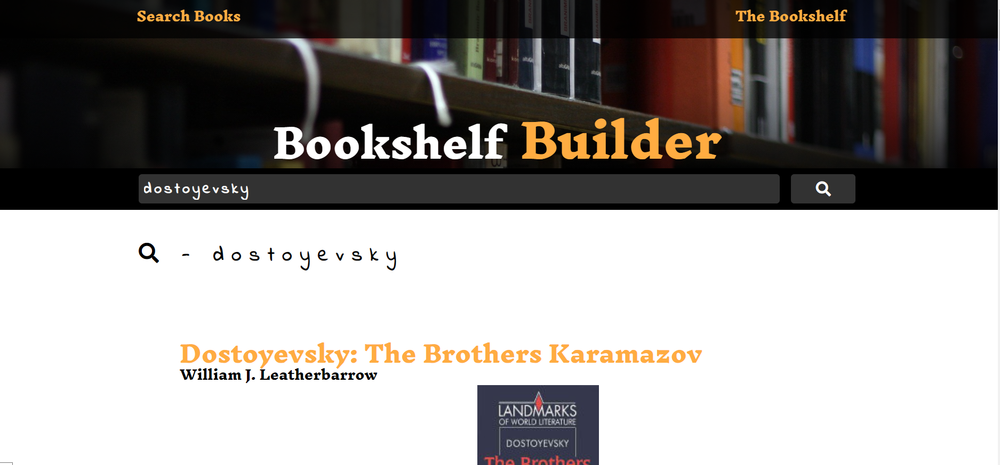

# MERN Bookshelf Builder

**Live Deactivated (Teaching materials moved away from classes and to hooks)**

React app that draws a list of books from Google books API given query. Saves selected books for future reference.

Created to show students how MERN comes together in the simplest way.

Still keep around to show students the class equivalent of hooks.

## Screenshot

